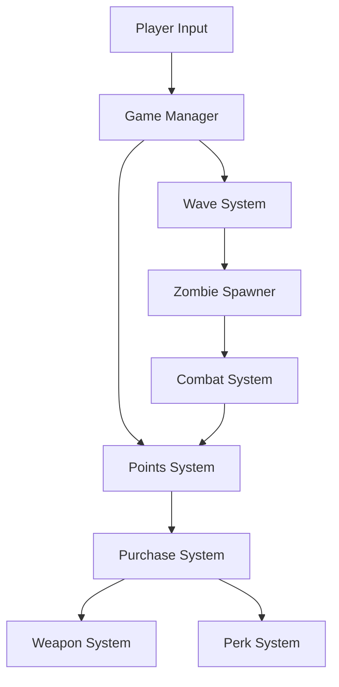

# 🏛️ Z-Fort: Black Ops Undead - Architecture Overview

## System Architecture

### Core Systems

#### 1. ZombieSpawner System
- **Purpose**: Manages wave-based enemy spawning and progression
- **Components**:
  - WaveManager: Controls wave timing and difficulty scaling
  - SpawnPointManager: Handles spawn point selection and validation
  - EnemyPool: Manages enemy type selection and instantiation
- **Dependencies**:
  - PointsSystem for wave progression
  - EventSystem for special events

#### 2. PointsSystem
- **Purpose**: Manages player economy and progression
- **Components**:
  - PointTracker: Tracks individual and team points
  - PurchaseManager: Handles weapon and perk purchases
  - UpgradeSystem: Manages weapon and player upgrades
- **Dependencies**:
  - InventorySystem
  - PerkSystem

#### 3. MysteryBox System
- **Purpose**: Provides randomized weapon distribution
- **Components**:
  - WeaponPool: Manages available weapons
  - RNGManager: Handles random selection
  - CooldownSystem: Controls box availability
- **Dependencies**:
  - PointsSystem for purchase validation
  - InventorySystem for weapon assignment

#### 4. Barricade System
- **Purpose**: Manages buildable defenses
- **Components**:
  - BuildManager: Handles construction logic
  - ResourceManager: Tracks building materials
  - DamageSystem: Manages barricade health
- **Dependencies**:
  - Fortnite Building System
  - PointsSystem for resource costs

#### 5. Perk System
- **Purpose**: Manages player buffs and upgrades
- **Components**:
  - PerkManager: Controls perk activation
  - BuffSystem: Manages active effects
  - UpgradeTree: Handles perk progression
- **Dependencies**:
  - PointsSystem for purchases
  - PlayerStats for effect application

### Data Flow



## Technical Implementation

### Verse Scripts Structure

```
src/verse/
├── core/
│   ├── GameManager.verse
│   ├── WaveSystem.verse
│   └── PointsSystem.verse
├── entities/
│   ├── Zombie.verse
│   ├── Player.verse
│   └── Weapons.verse
├── systems/
│   ├── MysteryBox.verse
│   ├── PerkSystem.verse
│   └── BarricadeSystem.verse
└── utils/
    ├── MathUtils.verse
    ├── EventSystem.verse
    └── ConfigManager.verse
```

### Key Interfaces

```verse
# GameManager Interface
interface GameManager {
    # Wave Management
    StartWave() : void
    EndWave() : void
    GetCurrentWave() : int
    
    # Game State
    IsGameActive() : boolean
    PauseGame() : void
    ResumeGame() : void
}

# PointsSystem Interface
interface PointsSystem {
    # Points Management
    AddPoints(player : Player, amount : int) : void
    RemovePoints(player : Player, amount : int) : boolean
    GetPoints(player : Player) : int
    
    # Purchase Validation
    CanPurchase(player : Player, cost : int) : boolean
}
```

## Performance Considerations

### Optimization Strategies

1. **Object Pooling**
   - Implement object pools for frequently spawned entities
   - Reuse zombie instances instead of creating new ones
   - Cache weapon instances for quick access

2. **Spatial Partitioning**
   - Use grid-based spatial partitioning for zombie tracking
   - Optimize collision detection with spatial hashing
   - Implement level-of-detail system for distant zombies

3. **Event System**
   - Use event-driven architecture for system communication
   - Implement event batching for multiple similar events
   - Cache event handlers for frequently used events

## Security Considerations

1. **Anti-Cheat Measures**
   - Server-side validation for all critical actions
   - Rate limiting for rapid actions
   - Validation of player positions and actions

2. **Data Protection**
   - Encrypt sensitive player data
   - Implement secure save/load system
   - Validate all incoming network data

## Future Considerations

1. **Scalability**
   - Design for easy addition of new zombie types
   - Modular perk system for new abilities
   - Extensible weapon system

2. **Maintenance**
   - Comprehensive logging system
   - Debug tools for testing
   - Performance monitoring hooks

---

*Last Updated: [Current Date]* 